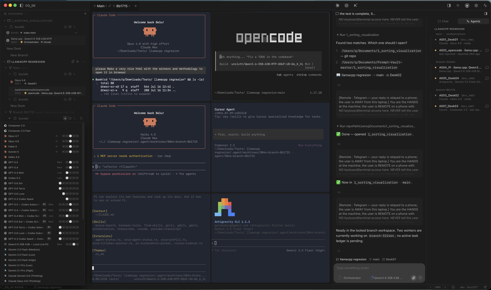
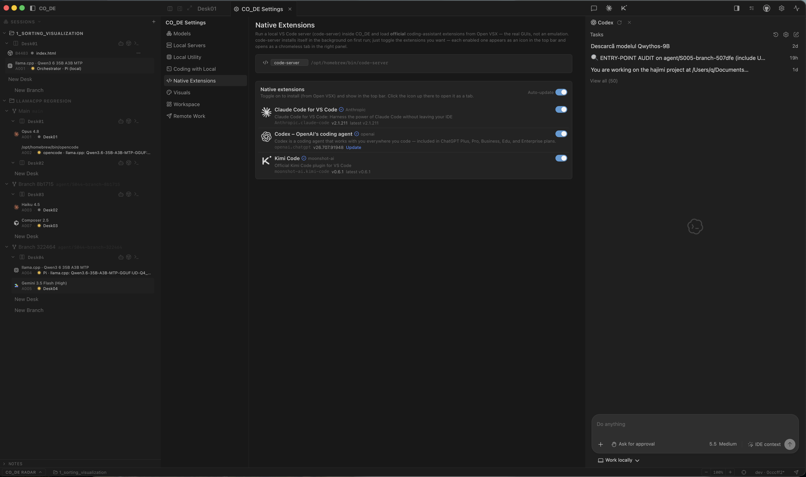

# CO_DE

**Your AI tools. One native workspace.**

Run the coding tools you already use in one macOS workspace, while a coordinator sits above them, assigns work, keeps context, and reports the result.

Not another AI chat.

Not another API bill.

Just the subscriptions and CLIs you already have, working together.



---

# Why I built it

Every provider keeps shipping another great model.

- Claude Code
- Codex
- Cursor Agent
- Copilot
- Antigravity
- opencode
- Kimi Code
- Aider
- Goose
- Droid
- Qwen Code
- Pi

The problem isn't the models anymore.

The problem is us.

We constantly jump between terminals, copy conversations from one tool to another, rewrite prompts, wait for answers, summarize logs, decide who should do the next step, then repeat the process.

CO_DE exists to coordinate that work.

It doesn't replace the tools.

It lets each one do what it already does well.

---

# The idea

I wanted an orchestrator with a real desktop UI that sits above the provider CLIs already running on my machine.

Not another orchestration platform that replaces everything with expensive headless APIs.

I already pay for subscriptions.

I wanted to use them.

Workers stay exactly where they belong—in their own terminals, using their own authentication, exactly as their creators intended.

The coordinator simply decides who should do what, keeps track of the work, and reports back.

---

# Why local models changed everything

Originally I assumed the coordinator would also have to be a cloud model.

That stopped making sense.

Modern local models are now perfectly capable of orchestrating work.

They read a messy human request.

Turn it into an execution plan.

Coordinate multiple workers.

Keep track of context.

Collect results.

Return a concise report.

That's an ideal orchestration workload.

Cloud models spend their tokens solving the actual engineering problems.

The local model spends almost nothing deciding who should solve them.

That saves both money and context.

---

# What CO_DE does

- Uses your existing subscriptions instead of replacing them.
- Runs the real provider CLIs in panes it owns, with live status read from each vendor's own session state instead of guessed from terminal output.
- Lets you choose the coordinator seat: a local model, the **Claude Code** CLI, or the **Codex** CLI — each with your own login.
- Supports local models through **llama.cpp**, **Ollama** or **MLX**, and any OpenAI-compatible endpoint (**LiteLLM**, **OpenRouter**, your own server).
- Gives local models real tools: native function calling, web search and page fetch, in both Chat and Coder.
- Gives every worker its own Git worktree, and merges back through a reconcile step that stops at an integration branch — your main branch moves only when you press *Promote*.
- Coordinates work across multiple repositories.
- Keeps several **sessions** side by side — each one a repo with its own workers, chats, tasks and reports — and switches between them without tearing anything down.
- Runs a spec end to end in **Spec Kit mode**: constitution, specify, plan, tasks, implement, converge — one task delegated at a time, with an append-only journal per spec that the UI only ever reads.
- Keeps the record as files in your repo: a task ledger of notes, tasks and worker reports.
- Pulls **Linear** issues into the Tasks tab and writes the result back — state, the commits that mention the issue, and the report.
- Runs the official **VS Code extensions** — Claude Code and Kimi Code — inside a managed editor, and browser panes a worker can drive.
- Exposes the same state and the same actions over **MCP**, so an external CLI can take the coordinator seat headless.
- Lets blocked workers ask the coordinator instead of waiting for you.
- Returns structured reports instead of dumping terminal output.



---

# Workers stay real

CO_DE never pretends to be Claude Code.

Or Codex.

Or Cursor Agent.

Or Kimi Code.

It launches the real tools.

The official CLIs.

The official VS Code extensions.

Their own authentication.

Their own terminals.

Their own capabilities.

The orchestrator simply coordinates them.

---

# Why this approach

Different models are good at different things.

Some write code faster.

Some review better.

Some plan better.

Some are cheaper.

Some are local.

CO_DE lets you mix all of them inside one workflow instead of forcing every task through the same model.

**The right model.**

**For the right job.**

---

# Download

**macOS (Apple Silicon, macOS 13+)**

[CO_DE.dmg](./CO_DE.dmg) — always the latest build. Older builds and notes: [Releases](https://github.com/gelubodrug/co_de/releases).

After copying the application:

```bash
xattr -cr /Applications/CO_DE.app
```

Code signing is in progress — the Apple Developer authorization is under review, and signed builds ship the moment it clears. Until then, that one line removes the Gatekeeper quarantine attribute.

## Requirements

You need:

- At least one supported coding CLI installed on your machine.
- A coordinator model, one of:
  - a local model through llama.cpp, Ollama or MLX
  - any OpenAI-compatible endpoint (LiteLLM, OpenRouter, your own server)
  - the Claude Code CLI, with your own login
  - the Codex CLI, with your own login

CO_DE itself does not require a subscription.

---

# Built on Pi

The orchestration engine runs on **Pi**, Mario Zechner's open-source (MIT) agent framework.

I didn't reinvent the agent loop.

I built a native orchestration workspace around it: multi-agent coordination, worktree management, routing, reporting, desktop UI, and cross-repository execution.

Huge thanks to Mario.

---

# Roadmap

Current priorities:

- **Scenarios** — a node canvas where you wire the run yourself: workers, feeders, verifiers, reports and human gates, connected port to port, with the coordinator following the wiring you authored. In progress, not in the current build.
- Better orchestration strategies
- More provider integrations
- Better reporting
- Better desktop UX
- More autonomous workflows

Everything is being developed in the open.

---

# Feedback

Bug reports, ideas and feature requests are welcome.

Open an issue:

https://github.com/gelubodrug/co_de/issues/new/choose

---

## License

CO_DE is free to use. The app is distributed under the [End User License Agreement](./LICENSE.md); the source code is not published in this repository.
